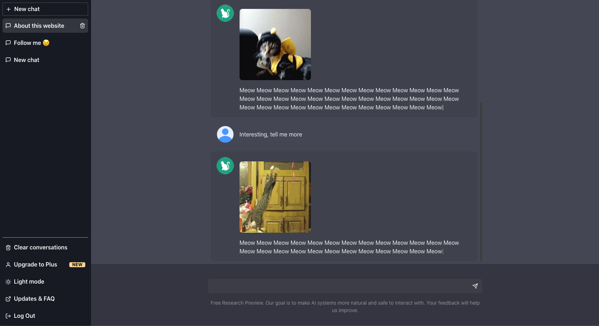

# CatGPT UI Clone 🐱

A parody of [clone of the ChatGPT](https://wesleymaik.github.io/chatgpt-ui-clone) website UI

## demo: https://wesleymaik.github.io/cat-gpt

---

<div align="center">



</div>

## Requirements

- node >= v16.16.0
- npm or yarn

## Built with

- ViteJS (React)
- ChakraUI
- Zustand

## Getting Started

1. Clone the project

```
git clone https://github.com/WesleyMaik/cat-gpt
```

2. Install dependencies

```
npm install
```

or

```
yarn install
```

3. Run 🔥

```
npm run dev
```

or

```
yarn dev
```

---

### Feedback

Feedback is appreciated! Reach out on [Twitter](https://twitter.com/euwesleymaik), [Instagram](https://twitter.com/euwesleymaik) or submit a new issue!

---

### Inspired by https://www.cat-gpt.com

---

"ChatGPT", "OpenAI" and its respective logos are owned by OpenAI Inc. All rights are reserved by the company. My intention with the project is just for study and no monetization is being generated from it.
